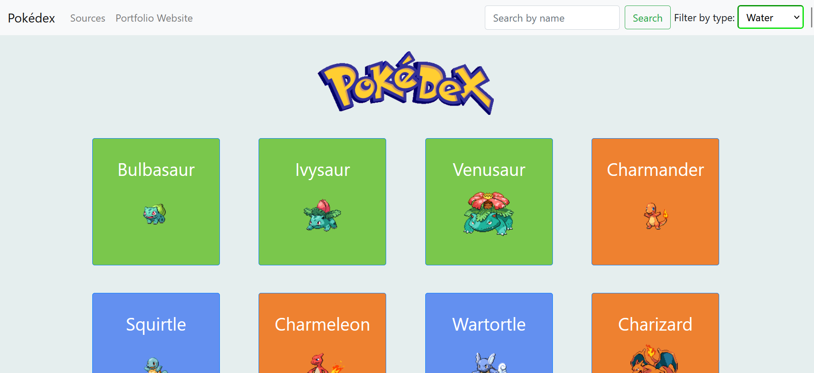

## Pokedex App

Goal: To build a small web application with HTML, CSS, and JavaScript that loads data from an external API and enables the viewing of data points in detail through the use of modals.

## Link To the App:

https://philippeducasse.github.io/Pokedex-App/

## Screenshot

## The Project

In this project, I had to write the code for retrieving data from an external API using Javascript. The app designed retrieves Pokémon data from the API and dynamically loads the Pokémon names on the screen. Each name corresponds to a button, and when the button is clicked additional details, such as weight, height, type of pokémon, and an image is displayed through a modal. These details are again loaded asychronously from the API(https://pokeapi.co/) using the AJAX concept.

Some code was also written in JQUery. Finally, I appplied some styling to the app by using an UI interface, Bootstrap.

## technologies & concepts used:

- HTML
- CSS
- Vanilla JS
- AJAX 
- Jquery
- BootStrap
- Polyfills (for fetch & promises)

## How to run the project locally

As this project was built using mostly vanilla JS, running this code is fairly straightforward. Once the repository is cloned, open the index.html page in the browser of your choice. 

## Credits

Thank you to my mentor from CareerFoundry, Treasure Kabareebe & my tutor Jonathan Nshuti. Special thanks to my friend Stephen Duke. 